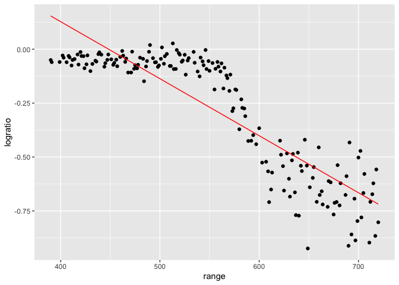

20241112_cross_validation
================
2024-11-12

Question: which linear regression will you use? Useful when there is one
super clear hypothesis and want to know whether this one variable
important in the context of the overall analysis

But more than often, need to assess what best fits into the model and
compare models, but have to be worried about multiple comparisons
(fishing)

Basic question of modelling:

- does my model fit and is it too complex? (under / over fitting)

- do i have high bias (just off from the truth) or high variance (one
  dataset get this answer another dataset will get another answer)

- will my model generalise to future datasets? is what im doing only
  depenedent on the sample that i have now or can it work well with the
  future too? Balancing underfit to overfit

**Model selection**

to see whether the model that i built on my first dataset will be
accurate for a second dataset (whether the prediction can work); but
this is rare that someone will give you a new dataset to just make
predictions (usually only get one dataset)

To overcome this, split the one dataset into two (training 80% and
testing 20%)

- Training data is what used to build the model
- Testing is the data that you use to evaluate out-of-sample fit

Evaluate the model (accurate of predictions) with root mean squared
error (lowest)

**Refinements and variations**

repeat this model building (repeat the training and tetsing split)

**k-fold validation**

instead splitting into 80/20 training split but you partition the data
into k equally sized subsets

**Prediction rather than statistical inference**

Which model is going to be the most generalisable. Do not get a p-value
of whether my model is accurate. Means that need to think about /
evaluate my model differently from hypothesis testing when you just
compare to a p-value / null hypothesis

**Steps**

- Training and Testing split

- Generate model and get root mean squared error

- Repeat the training and testing split

- minimize root mean squared error

## Look at LIDAR data

The lidar data frame has 221 observations from a light detection and
ranging (LIDAR) experiment.

range = distance travelled before the light is reflected back to its
source.

logratio = logarithm of the ratio of received light from two laser
sources.

``` r
data("lidar")

lidar_df = 
  lidar %>% 
  as_tibble() %>% 
  mutate(
    id = row_number())
```

``` r
lidar_df %>% 
  ggplot(aes(x = range, y = logratio)) + 
  geom_point()
```

<!-- -->

## Try to do Cross Validation

We’ll compare 3 models – one linear, smooth and wiggly

``` r
train_df = sample_frac(lidar_df, size = .8)
#split into training data set, then testing dataset is everything that is not in the training dataset 

test_df = anti_join(lidar_df, train_df, by = "id")
```

Looking at these dataframes

``` r
ggplot(train_df, aes(x = range, y = logratio)) +
  geom_point() +
  geom_point( data = test_df, color = "red")
```

<!-- -->

Now trying to fitting models (one model is too complex another under
complex and both make bad predictions. then the last is just right)

## Fitting a models

order: not complex enough, just right, too complex

``` r
linear_mod = lm(logratio ~ range, data = train_df)
smooth_mod = gam(logratio ~ s(range), data = train_df)
wiggly_mod = gam(logratio ~ s(range, k = 30), sp = 10e-6, data = train_df)
```

Looking at these fits

``` r
train_df %>% 
  add_predictions(linear_mod) %>% 
  ggplot(aes(x = range, y = logratio)) + 
  geom_point() + 
  geom_line(aes(y = pred), color = "red")
```

<!-- -->

``` r
train_df %>% 
  add_predictions(wiggly_mod) %>% 
  ggplot(aes(x = range, y = logratio)) + 
  geom_point() + 
  geom_line(aes(y = pred), color = "red")
```

<!-- -->

This wiggly model is overcompensating, overfitting the dataset. that if
the model was applied to another dataset it won’t be able to predict so
well.

``` r
train_df %>% 
  add_predictions(smooth_mod) %>% 
  ggplot(aes(x = range, y = logratio)) + 
  geom_point() + 
  geom_line(aes(y = pred), color = "red")
```

<!-- -->

smooth model fit is just right, flexible model structure that it
captures the trends but it doesn’t overfit
