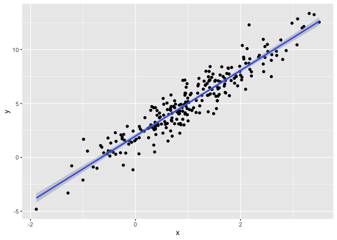

20241114_bootstrapping
================
2024-11-14

similar to cross validation (model comparison) doing the same process
over and over (CV which model makes best predictions and do it over and
over again)

Bootstrapping is more for statistical inferences People use for
everything all the time again repeated sampling involved (but in reality
cannot repeated sample over and over to get true population mean but can
do it in code)

In code the idea is to mimic repeated sampling with one sample \* draw a
bootstrap sample from one sample you have

- the bootstrap sample has the same sample size as teh original sample
  and is drawn with replacement

- mimics repeated sampling, analyse this sample using intended approach

- and repeat

Bootstrapping. = sampling with replacement until the original n number

Coding in bootstrapping = draw sample with replacement, analyse, keep
track of results with listcols, and repeat

## Do some bootstrapping

Let’s make up data first and see where bootstrapping comes in handy

Make a simulated dataframe, where x coming from normal distribution and
250 observations

Let’s create some simulated data. First I’ll generate x, then an error
sampled from a normal distribution, and then a response y; this all gets
stored in sim_df_const. Then I’ll modify this by multiplying the errors
by a term that involves x, and create a new response variable y.

By generating data in this way, I’m creating one case in which the usual
linear regression assumptions hold and one case in which they don’t
(non-constant variance of error terms across the variables; in linear
regression an assumption is that the error terms are independent). The
plot below illustrates the differences between the dataset.

``` r
n_samp = 250 

sim_df_constant = 
  tibble(
    x = rnorm(n_samp, 1, 1),
    error = rnorm(n_samp, 0, 1),
    y = 2 + 3 * x + error
  )

sim_df_nonconstant = 
  sim_df_constant %>% 
  mutate (
    error = error * .75 * x,
    y = 2 + 3 * x + error 
  )
```

Let’s look at these

``` r
sim_df_constant %>% 
  ggplot(aes(x = x, y = y)) + 
  geom_point() +
  stat_smooth(method = "lm")
```

    ## `geom_smooth()` using formula = 'y ~ x'

<!-- -->

``` r
sim_df_nonconstant %>% 
  ggplot(aes(x = x, y = y)) + 
  geom_point() +
  stat_smooth(method = "lm")
```

    ## `geom_smooth()` using formula = 'y ~ x'

<!-- -->

These datasets have roughly the same overall variance, but the left
panel shows data with constant variance and the right panel shows data
with non-constant variance. For this reason, ordinary least squares
should provide reasonable estimates in both cases, but inference is
standard inference approaches may only be justified for the data on the
left.

Look at regression results

``` r
sim_df_constant %>% 
  lm(y ~ x, data = .) %>% 
  broom::tidy() %>% 
  knitr::kable(digits = 3)
```

| term        | estimate | std.error | statistic | p.value |
|:------------|---------:|----------:|----------:|--------:|
| (Intercept) |    1.977 |     0.098 |    20.157 |       0 |
| x           |    3.045 |     0.070 |    43.537 |       0 |

``` r
sim_df_nonconstant %>% 
  lm(y ~ x, data = .) %>% 
  broom::tidy() %>% 
  knitr::kable(digits = 3)
```

| term        | estimate | std.error | statistic | p.value |
|:------------|---------:|----------:|----------:|--------:|
| (Intercept) |    1.934 |     0.105 |    18.456 |       0 |
| x           |    3.112 |     0.075 |    41.661 |       0 |

Despite the very different error structures, standard errors for
coefficient estimates are similar in both cases!

We’ll use the bootstrap to make inference for the data on the right.
**This is intended largely as an illustration for how to use the
bootstrap in cases where the theoretical distribution is “unknown”**,
although for these data in particular weighted least squares could be
more appropriate.

## Bootstrap example

Hand me a dataframe and i will repeated draw samples from that dataframe
of the same size with replacement

``` r
boot_sample = function(df){
  
  boot_df = 
    sample_frac(df, replace = TRUE) %>% 
    arrange(x)
  
  return(boot_df)
}
```

Let’s try running this

``` r
sim_df_nonconstant %>% 
  boot_sample %>% 
  ggplot(aes(x = x, y = y)) +
  geom_point(alpha = .5) + 
  stat_smooth(method = "lm")
```

    ## `geom_smooth()` using formula = 'y ~ x'

<!-- -->

The darker points indicate the points have be sampled more than once in
the bootstrap sample

Each bootstrap sample gives different regression fit The goal then,
running over and over bootstrap sample. If i do it repeatedly thousands
of times the variability over all the bootstrap samples should be the
real variability of the sample Before we could only judge varibaility
based on one sample (but the judgement of the variance was too close to
when the variance was constant but it is actually non-constant)

Can we do this as part of an analysis?

``` r
sim_df_nonconstant %>% 
  boot_sample() %>% 
  lm(y ~ x, data = .) %>% 
  broom::tidy() %>% 
  knitr::kable(digits = 3)
```

| term        | estimate | std.error | statistic | p.value |
|:------------|---------:|----------:|----------:|--------:|
| (Intercept) |    1.896 |     0.098 |    19.311 |       0 |
| x           |    3.142 |     0.069 |    45.636 |       0 |

Doing it 1000 times here is the actual distribution of the slope

Create a df with 1000 bootstrap samples, analyse all of them, then pull
out the results

## Bootstrap a lot

``` r
boot_straps = 
  tibble(
    strap_number = 1:1000
  ) %>% 
  mutate(
    strap_sample = map(strap_number, \(x) boot_sample(df = sim_df_nonconstant))
  )

boot_straps
```

    ## # A tibble: 1,000 × 2
    ##    strap_number strap_sample      
    ##           <int> <list>            
    ##  1            1 <tibble [250 × 3]>
    ##  2            2 <tibble [250 × 3]>
    ##  3            3 <tibble [250 × 3]>
    ##  4            4 <tibble [250 × 3]>
    ##  5            5 <tibble [250 × 3]>
    ##  6            6 <tibble [250 × 3]>
    ##  7            7 <tibble [250 × 3]>
    ##  8            8 <tibble [250 × 3]>
    ##  9            9 <tibble [250 × 3]>
    ## 10           10 <tibble [250 × 3]>
    ## # ℹ 990 more rows

Now let’s start fitting linear regression models to each bootstrap

``` r
boot_straps = 
  tibble(
    strap_number = 1:1000
  ) %>% 
  mutate(
    strap_sample = map(strap_number, \(x) boot_sample(df = sim_df_nonconstant)),
    models = map(strap_sample, \(df) lm(y ~ x, data = df))
  )

boot_straps
```

    ## # A tibble: 1,000 × 3
    ##    strap_number strap_sample       models
    ##           <int> <list>             <list>
    ##  1            1 <tibble [250 × 3]> <lm>  
    ##  2            2 <tibble [250 × 3]> <lm>  
    ##  3            3 <tibble [250 × 3]> <lm>  
    ##  4            4 <tibble [250 × 3]> <lm>  
    ##  5            5 <tibble [250 × 3]> <lm>  
    ##  6            6 <tibble [250 × 3]> <lm>  
    ##  7            7 <tibble [250 × 3]> <lm>  
    ##  8            8 <tibble [250 × 3]> <lm>  
    ##  9            9 <tibble [250 × 3]> <lm>  
    ## 10           10 <tibble [250 × 3]> <lm>  
    ## # ℹ 990 more rows

After linear models, want to get results of intercepts / slopes

``` r
boot_straps = 
  tibble(
    strap_number = 1:1000
  ) %>% 
  mutate(
    strap_sample = map(strap_number, \(x) boot_sample(df = sim_df_nonconstant)),
    models = map(strap_sample, \(df) lm(y ~ x, data = df)),
    results = map(models, broom::tidy)
  )

boot_straps
```

    ## # A tibble: 1,000 × 4
    ##    strap_number strap_sample       models results         
    ##           <int> <list>             <list> <list>          
    ##  1            1 <tibble [250 × 3]> <lm>   <tibble [2 × 5]>
    ##  2            2 <tibble [250 × 3]> <lm>   <tibble [2 × 5]>
    ##  3            3 <tibble [250 × 3]> <lm>   <tibble [2 × 5]>
    ##  4            4 <tibble [250 × 3]> <lm>   <tibble [2 × 5]>
    ##  5            5 <tibble [250 × 3]> <lm>   <tibble [2 × 5]>
    ##  6            6 <tibble [250 × 3]> <lm>   <tibble [2 × 5]>
    ##  7            7 <tibble [250 × 3]> <lm>   <tibble [2 × 5]>
    ##  8            8 <tibble [250 × 3]> <lm>   <tibble [2 × 5]>
    ##  9            9 <tibble [250 × 3]> <lm>   <tibble [2 × 5]>
    ## 10           10 <tibble [250 × 3]> <lm>   <tibble [2 × 5]>
    ## # ℹ 990 more rows

``` r
bootstraps_results = 
  boot_straps %>% 
  select(strap_number, results) %>% 
  unnest(results)

bootstraps_results
```

    ## # A tibble: 2,000 × 6
    ##    strap_number term        estimate std.error statistic   p.value
    ##           <int> <chr>          <dbl>     <dbl>     <dbl>     <dbl>
    ##  1            1 (Intercept)     1.82    0.0923      19.8 7.82e- 53
    ##  2            1 x               3.07    0.0659      46.5 1.90e-124
    ##  3            2 (Intercept)     1.90    0.104       18.2 1.07e- 47
    ##  4            2 x               3.09    0.0756      40.9 3.22e-112
    ##  5            3 (Intercept)     2.01    0.114       17.6 2.16e- 45
    ##  6            3 x               3.15    0.0760      41.5 1.15e-113
    ##  7            4 (Intercept)     1.89    0.113       16.8 7.93e- 43
    ##  8            4 x               3.30    0.0765      43.1 3.07e-117
    ##  9            5 (Intercept)     2.00    0.102       19.7 1.52e- 52
    ## 10            5 x               3.03    0.0715      42.4 1.40e-115
    ## # ℹ 1,990 more rows

And then all i care about is the bootstrap id number and the results

Want to ask how is variable is the intercept is slope (what is the
standard error of this sample actually)

Everytime fitting for boostrap sample seeing how variable it is, then
repeating it to estimate the confidence intervals for the sample
(esepecially useful when CLT assumptions cannot work)

``` r
bootstraps_results = 
  boot_straps %>% 
  select(strap_number, results) %>% 
  unnest(results) %>% 
  group_by(term) %>% 
  summarise(
    boot_se = sd(estimate)
  ) %>% 
  knitr::kable(digits = 3)

bootstraps_results
```

| term        | boot_se |
|:------------|--------:|
| (Intercept) |   0.079 |
| x           |   0.104 |

Results is better since in the constant, the variability in intercept /
slope is one number and we would expect that if the error terms were not
independent and regression assumptions are violated we would expect
error terms to be even more varied and larger and that is what we see

non-constant intercept / slope se: 0.067 and 0.100 constnat intercept /
slope se = 0.087 and 0.064 (smaller)

## do this all using modelr

instead of mapping if i wanted to

``` r
boot_straps = 
  sim_df_nonconstant %>% 
  modelr::bootstrap(1000) %>% 
  mutate(
    strap = map(strap, as_tibble),
    models = map(strap, \(df) lm(y ~ x, data = df)),
    results = map(models, broom::tidy)
  ) %>% 
  select(.id, results) %>% 
  unnest(results)

boot_straps
```

    ## # A tibble: 2,000 × 6
    ##    .id   term        estimate std.error statistic   p.value
    ##    <chr> <chr>          <dbl>     <dbl>     <dbl>     <dbl>
    ##  1 0001  (Intercept)     1.88    0.117       16.1 1.84e- 40
    ##  2 0001  x               3.28    0.0838      39.1 3.98e-108
    ##  3 0002  (Intercept)     2.03    0.125       16.2 1.35e- 40
    ##  4 0002  x               3.03    0.0857      35.3 9.39e- 99
    ##  5 0003  (Intercept)     1.96    0.115       17.1 8.21e- 44
    ##  6 0003  x               3.13    0.0807      38.8 2.19e-107
    ##  7 0004  (Intercept)     1.87    0.0860      21.8 1.49e- 59
    ##  8 0004  x               3.18    0.0645      49.3 3.89e-130
    ##  9 0005  (Intercept)     1.96    0.103       19.2 7.39e- 51
    ## 10 0005  x               3.04    0.0703      43.3 1.55e-117
    ## # ℹ 1,990 more rows

## What should i report at the tail-end of bootstrapping?

``` r
boot_straps %>% 
  group_by(term) %>% 
  summarise(
    boot_est = mean(estimate),
    boot_se = sd(estimate),
    boot_ci_ll = quantile(estimate, 0.025),
    boot_ci_ul = quantile(estimate, 0.975)
  )
```

    ## # A tibble: 2 × 5
    ##   term        boot_est boot_se boot_ci_ll boot_ci_ul
    ##   <chr>          <dbl>   <dbl>      <dbl>      <dbl>
    ## 1 (Intercept)     1.93  0.0764       1.78       2.09
    ## 2 x               3.11  0.105        2.90       3.32

## AirBNB

``` r
data("nyc_airbnb")

nyc_airbnb = 
  nyc_airbnb |> 
  mutate(stars = review_scores_location / 2) |> 
  rename(
    borough = neighbourhood_group,
    neighborhood = neighbourhood) |> 
  filter(borough != "Staten Island") |> 
  drop_na(price, stars) |> 
  select(price, stars, borough, neighborhood, room_type)

nyc_airbnb |> 
  ggplot(aes(x = stars, y = price, color = room_type)) + 
  geom_point() 
```

<!-- -->

Fit a regression of stars against room types in Manhattan

plotting the data

Looking at how this graph / distribution came out unlikely that a linear
regression is going to work appropriately here. We can bootstrap to
examine the distribution of regression coefficients under repeated
sampling.

``` r
nyc_airbnb |> 
  filter(borough == "Manhattan") |> 
  modelr::bootstrap(n = 1000) |> 
  mutate(
    models = map(strap, \(df) lm(price ~ stars + room_type, data = df)),
    results = map(models, broom::tidy)) |> 
  select(results) |> 
  unnest(results) |> 
  filter(term == "stars") |> 
  ggplot(aes(x = estimate)) + geom_density()
```

<!-- -->
